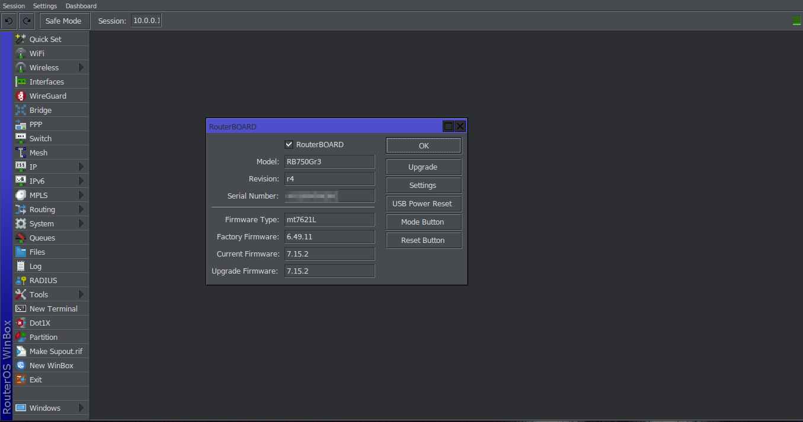

# winbox-darkmode
Dark mode for the Mikrotik Winbox program
Prerequisites:
git, wget, wine

Steps (as the user you want to install this as, NOT ROOT !!):
* cd ~/Downloads/ && wget https://raw.githubusercontent.com/Jan64X/winbox-darkmode/main/init.sh && chmod +x ./init.sh && ./init.sh && cd ~/Downloads && rm ./init.sh

And now the script should tell you what to do.

Screenshots:

